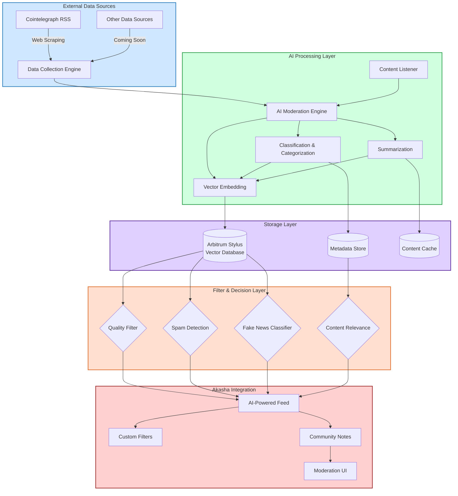

# Curation Agent

## Overview

Curation agent is AI agent focused on collecting, filtering and curating news sources, posts and messages for the Akasha Network Core to prevent spam, fake news and gather information from third-aprty sources.

## Features

- First ever onchain vector database built with Arbitrum Stylus smart contracts for storage, retrieval and comparisons of vectorized documents.
- Automated crypto news articles collection and cleanup thanks to webscraping cointelegraph
- news summarization, categorization and curation by AI
- Akasha app using Akasha devkit with AI-powered feeds, custom filters and curation powered by AI agent.

## Bounties

- **Main Tack**
- **Arbitrum Stylus**
- **Akasha Network**

## Business Plan

### Problem

Currently all major social networks and communities suffer from severe information pollution issues:

- Information Overload: Users are bombarded with thousands of articles, posts, and updates daily, making it impossible to distinguish signal from noise.
- Rampant Misinformation: as example the web3 space is plagued by fake news, pump-and-dump schemes, and misleading information that often leads to financial losses.
- Targeted Spam: Advanced bots and spammers target crypto communities with scams, phishing attempts, and malicious links.
- Siloed Data: Valuable information is scattered across platforms, making good research time-consuming and inefficient.
- Centralized Moderation: Current content moderation systems are typically black boxes controlled by centralized entities, creating trust issues and potential censorship concerns.

### Solution

Curation Agent provides a comprehensive solution through a multi-tiered approach:

- **Stylus Onchain Vector Db** - Semantic search and comparison of content across platforms
- **News Feed** - AI-powered personalization and curation without the problematic filter bubbles of traditional algorithms

### Target Users

1. Crypto Enthusiasts & Investors

2. Content Creators & Journalists

3. Akasha Network Members

## Revenue Streams

Freemium Model for End Users

- Basic access free for all users
  - Premium subscription ($5-15/month) for advanced features, custom filters, and API access
- Token Economy
  -Incentivization for quality curation and vector db data contributions

### 🌍 Impact & Ecosystem Fit

Curation Agent addresses critical infrastructure needs for the social networks. By combining AI with community verification on a blockchain it creates a trustworthy information environment that is resistant to manipulation and censorship.

## Setup

### Stylus

-

### AI Agent

- `cd /scripts`
- `npm i`
- test Stylus onchain vector db - `node test-vectordb.js`

### Akasha

-
